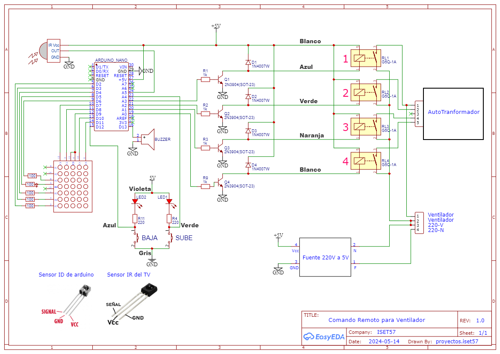
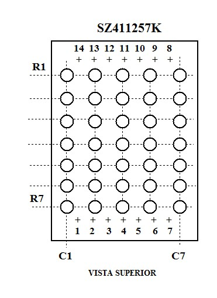
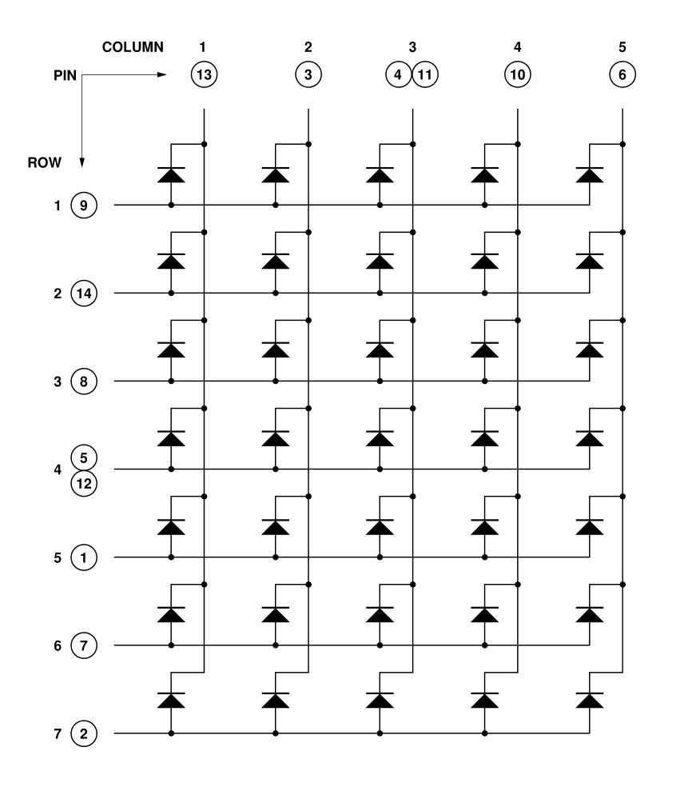
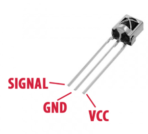

# Proyecto
Control remoto IR para ventilador de techo

**Alumnos del ISET 57, año 2024**

---

### Resumen:

Construir un dispositivo control remoto (ver los medios de comunicación) para reemplazar un control con autotransformador de un ventilador de techo.

Ideas:

-Usar un Arduino o un ESP32 y un remoto a infrarrojo, para utilizar cualquier remoto que esté al alcance.
-Usar un ESP32 si vamos a controlarlo desde WiFi (página web etc)
-Existe la posibilidad de usar el Bluetooth del ESP32, pero es necesario hacer una APP para el celular.
-Para cualquiera de los casos anteriores, colocar unos botones para poder controlarlo localmente (no remoto) por si se pierde el remoto o para más facilidad.
-Reemplazar la llave que selecciona las bobinas del autotransformador con algunos reles.

a trabajar ! ...

# Circuito

Está hecho con EasyEDA. Este es el link:

https://easyeda.com/editor#id=5612fed8abc0466180bf618d34320de8

# Display

# Sensor IR

